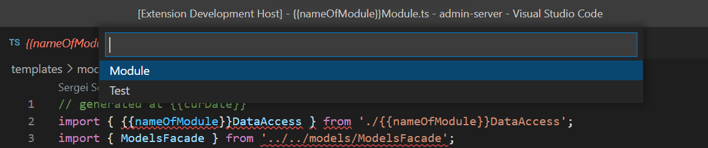
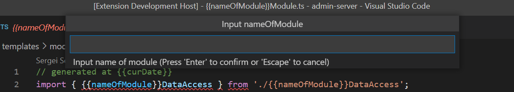
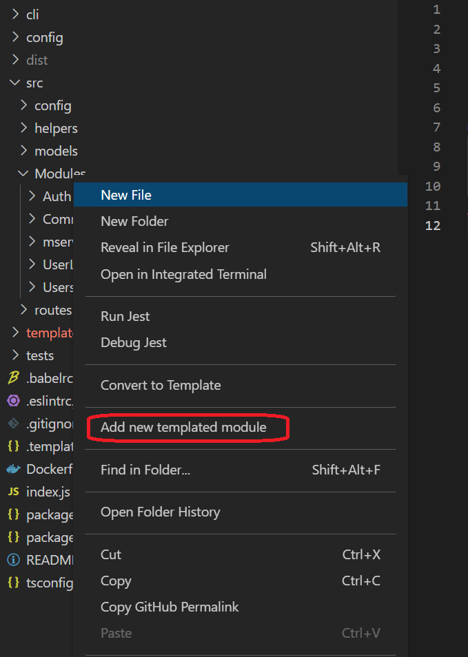

# Templated module generator

Templated module generator is tool for generating multiple files from template. It allows to create conneted files that are part of some "module" like MVC classes. It allows to create structure of new "module" wihtout typing a lot of code.

## Features

- Allows to create module based on workspace structure or paste some "module" into specified location 
- Allows to use input variables to generate code with correct names
- Allows to use calculated variables using JavaScript and another variables
- Allows to add special registration code
- Json schema for config

## Simple setup of extension
To use this extension you need to create file with name '.templateGenerator.json' in the workspace directory. This this describes what templates you want to use. Below there is example of such file
```
[
  {
    "name": "Module",
    "type": "workspace",
    "path": "templates/module",
    "variables": [
      {
        "name": "nameOfModule",
        "prompt": "Input name of module"
      },
      {
        "name": "nameOfModuleCamel",
        "input": false,
        "expression": "camelCase(nameOfModule)"
      },
      {
        "name": "curDate",
        "input": false,
        "expression": "new Date().toString()"
      }
    ],
    "actions": [
      {
        "type": "insertTemplateToFile",
        "fileName": "{{workspace_directory}}/index.js",
        "snippet": "// end list of modules init",
        "template": "init{{nameOfModule}}Module(modelsFacade),",
        "position": "before"
      },
      {
        "type": "insertTemplateToFile",
        "fileName": "{{workspace_directory}}/index.js",
        "snippet": "// end import modules",
        "template": "import { init{{nameOfModule}}Module } from './src/Modules/{{nameOfModule}}/{{nameOfModule}}Module';",
        "position": "before"
      }
    ]
  },
]
```
Config file contains array of descriptions of templates. Each template has 
- name of template
- type of template (workspace or local)
- path to templates directory
- descriptions of variables
- description post generation actions

"Workspace" template mean that template that is defined with structure of whole workspace. E.g. if workspace has structure
```
src
  app
    module1
    module2
test
  module1
  module2
```

than files in the template directory must follow structure like this
```
src
  app
    {{templatedMoudle}}
test
  {{testOftemplatedModule}}
```

If template type is "local" then all templates files with structure will be generated in the place where you click to generate code. E.g.
You template module has structure
```
{{templateModule}}
  {{file1}}
  {{file2}}
  test
    {{testFile1}}
    {{testFile2}}
```
Workspace structure is following
```
src
  app
    modules
      module1
      module2
```
When you click in context menu of modules directory "generate templated module" you will generate new module inside of modules directory. So you workspace will be
```
src
  app
    modules
      module1
      module2
      newModule
        newModuleFile1
        newModuleFile2
        test
          newModuleTestFile1
          newModuleTestFile2
```

### Templates
Templates are files with code with placeholders for variables. Placeholders are set using double braces. e.g. {{myVariable}}
Example of templated file
```
// generated at {{curDate}}
import { {{nameOfModule}}DataAccess } from './{{nameOfModule}}DataAccess';
import { ModelsFacade } from '../../models/ModelsFacade';
import { {{nameOfModule}}Service } from './{{nameOfModule}}Service';
import { set{{nameOfModule}}Service } from './{{nameOfModuleCamel}}Controller.socket';

export const init{{nameOfModule}}Module = async (modelsFacade: ModelsFacade) => {
  const dataAccess = new {{nameOfModule}}DataAccess(modelsFacade);
  const {{nameOfModuleCamel}}Service = new {{nameOfModule}}Service(dataAccess);
  set{{nameOfModule}}Service({{nameOfModuleCamel}}Service);
};
```
You can use any number of variables in templates.

You can setup multiple templates so when you choose to generate module you will see selection of templates to generate


### Variables
Variables are part of code that is inputed or calculated. By deafult all variables are inputed until thieres is not field `"input": false`.
So you need to input variables by hand.

When variable must be input then you can set prompt to describe meaning of the variable. If variable is not inputed you must set field `"expression": "some expression"`. Expressions are javascript code with additional build-in functions:
- camelCase
- pascalCase
- snakeCase
- fileContent
- workspaceToAbsolutePath
- absoluteToWorkspacePath
- pathJoin

There are also 2 build-in variables `workspace_directory` and `context_directory`. Variable `context_directory` is set only for templates with type "local".

E.g. it is possible to calculate varibale `nextId` with expression
`(parseInt(fileContent(pathJoin(workspace_directory, 'build.number'))) + 1).toString)`
There is not possibility to use external libraries in calculations.

You can use variables in name of files of the templates. I.e. your file can be `file{{module}}Name.js` and name will be generated for variable module=foo -> filefooName.js.


### Post generation actions
Currently there is only one post generation action. It inserts some pattern into file after or before specified line. Description of this action.
```
{
  "type": "insertTemplateToFile",
  "fileName": "{{workspace_directory}}/index.js",
  "snippet": "// end list of modules init",
  "template": "init{{nameOfModule}}Module(modelsFacade),",
  "position": "before"
},
```
- `type` - type of action. Can be only `insertTemplateToFile`
- `fileName` - file where to add `template`. Can contains variables
- `snippet` - pattern to search in the `fileName`. It is place to insert `temlate`
- `template` - what to insert. `template` can contains variables
- `position` - can be one of "before" and "after". Before means insert in the previous line of `snippet`. After means on next line of `snippet`

## How To use
Just call from context menu for the directory you want to apply new template.


## Requirements

If you have any requirements or dependencies, add a section describing those and how to install and configure them.

### 1.0.0

Initial release of Templated Module Generator


-----------------------------------------------------------------------------------------------------------